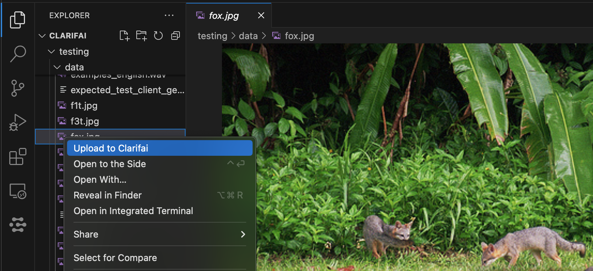

# 🌀 clarifai-vscode

This is a hackathon project to build vscode extension that allows integration with Clarifai

## Ideas
- add images Clarifai

- selectively add your files to Clarifai inputs without leaving your IDE or writing custom scripts
- simplistic labeling from within the IDE
- run code similarity search
- run RAG with any LLM from Clarifai arsenal to answer questions about your repository
    - load as much as possible from selected file into the context
        - use filesystem and recursive import statements to prioritize which files need to be added into context

## Extension Settings

Include if your extension adds any VS Code settings through the `contributes.configuration` extension point.

For example:

This extension contributes the following settings:

* `myExtension.enable`: Enable/disable this extension.
* `myExtension.thing`: Set to `blah` to do something.
